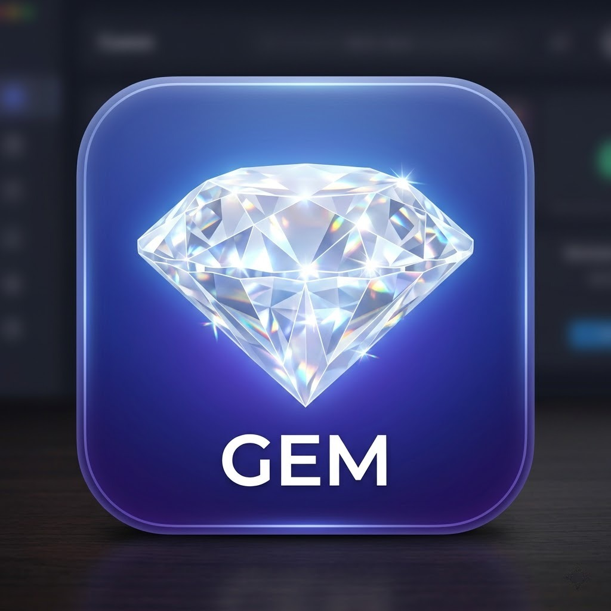

# ClearGem

  

Automatically removes visible watermarks from Google Gemini AI-generated images. Available as a Tampermonkey userscript and a Chrome/Firefox extension. Zero-click — just install and forget.

<table>
<tr>
<td align="center"><strong>Before</strong></td>
<td align="center"><strong>After</strong></td>
</tr>
<tr>
<td></td>
<td></td>
</tr>
</table>

## How It Works

Gemini stamps a semi-transparent white 4-pointed star logo in the bottom-right corner of every generated image using alpha compositing:

```
watermarked_pixel = alpha * 255 + (1 - alpha) * original_pixel
```

ClearGem reverses this mathematically to reconstruct the original pixels:

```
original_pixel = (watermarked_pixel - alpha * 255) / (1 - alpha)
```

Pre-calibrated alpha maps (48x48 and 96x96) are embedded directly. No AI inpainting, no server calls, no quality loss — pixel-perfect reconstruction with 99.9% accuracy (bounded only by 8-bit quantization).

## Features

- **Zero-click** — images are cleaned automatically as they appear in chat
- **Download interception** — Gemini's download button delivers clean images
- **Copy interception** — Gemini's copy button copies clean images to clipboard
- **Auto-detection** — picks 48x48 or 96x96 watermark size based on image dimensions
- **100% client-side** — nothing leaves your browser
- **Toast notifications** — subtle confirmation when images are cleaned

## Install

### Userscript (Tampermonkey / Greasemonkey)

1. Install [Tampermonkey](https://www.tampermonkey.net/) (or any userscript manager)
2. Download [`cleargem.user.js`](https://github.com/SysAdminDoc/ClearGem/releases/latest) from the latest release — Tampermonkey will prompt to install
3. Navigate to [gemini.google.com](https://gemini.google.com) — active immediately

### Chrome Extension

1. Download [`ClearGem-v1.0.4.zip`](https://github.com/SysAdminDoc/ClearGem/releases/latest) from the latest release and unzip
2. Go to `chrome://extensions`, enable **Developer mode**
3. Click **Load unpacked** and select the unzipped folder

Or drag the `.crx` file onto the extensions page.

### Firefox Extension

1. Download [`ClearGem-v1.0.4.xpi`](https://github.com/SysAdminDoc/ClearGem/releases/latest) from the latest release
2. Go to `about:addons`, click the gear icon, select **Install Add-on From File**

## Compatibility

| Site | Userscript | Extension |
|------|:----------:|:---------:|
| gemini.google.com | Yes | Yes |
| aistudio.google.com | Yes | Yes |

Userscript works with Tampermonkey MV3 (`@inject-into content`). Extension is Manifest V3.

## Limitations

- Removes the **visible** watermark only. Does **not** remove [SynthID](https://deepmind.google/technologies/synthid/) — Google's invisible steganographic watermark embedded at the pixel generation level. That requires diffusion model re-processing and is a fundamentally different problem.
- If Google changes the watermark pattern, position, or alpha values, the embedded alpha maps will need updating.

## Credits

Reverse alpha blending method and calibrated watermark masks based on [GeminiWatermarkTool](https://github.com/allenk/GeminiWatermarkTool) by Allen Kuo (MIT License). Alpha map data sourced from [gemini-watermark-remover](https://github.com/GargantuaX/gemini-watermark-remover).

## License

MIT
